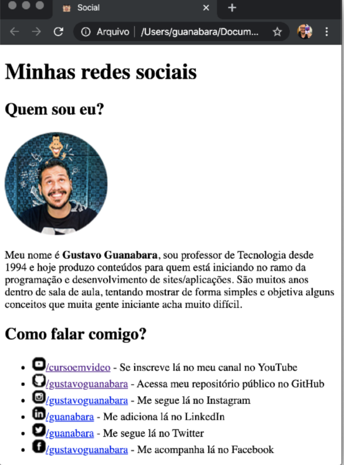
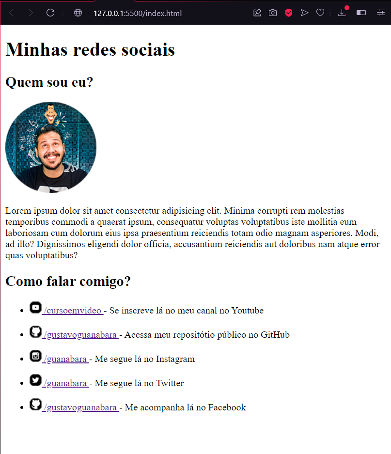

  

# Curso em Vídeo

  Durante os meus estudos na plataforma do Curso em Vídeo, irei estar postando todos os desafios e atividades que eu julgar pertinentes.
 

 
 ## Desafio 5
 

   O Desafio 5 do módulo 1 de HTML e CSS foi proposto no capítulo 10 da aula 4. A atividade é recriar um perfil social do Gustavo Guanabara.   Eis o resultado:
 

Exemplo dado:    

 Resultado:    

 
 ## Desafio 6
 

   O Desafio 6 do módulo 1 de HTML e CSS foi proposto no capítulo 10 da aula 4. A atividade é arrumar uma maneira que, ao passar o mouse sobre um termo, mostre qual é a tag utilizada para fazer isso.   Eis o resultado:
 

Exemplo dado:    

 Resultado:    

